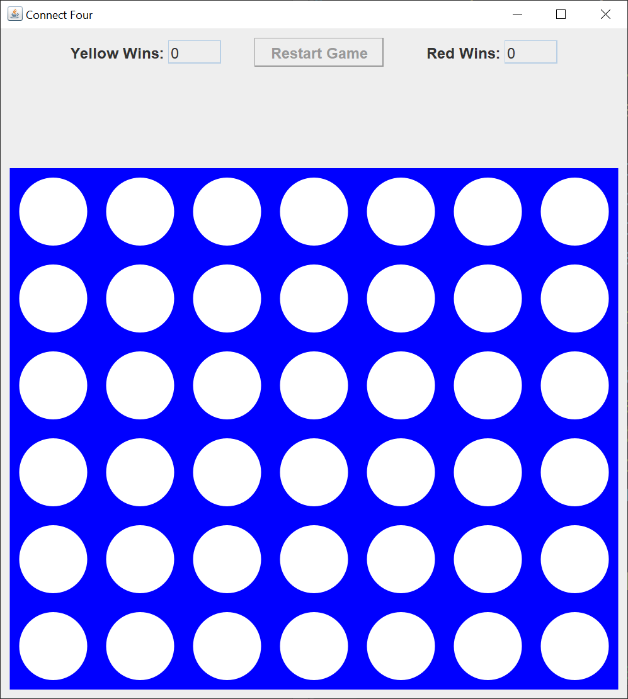
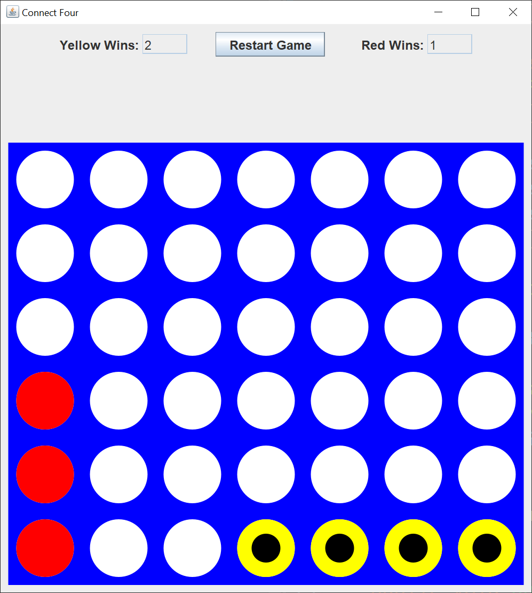

# Connect Four

## Introduction

For years, I've seen lots of Java developers create their version of a Connect Four game.

Players take turns dropping pieces into the vertical game board.  Each piece drops to the bottom of the board or on top the highest piece.  The object of the game is to get four pieces in a row, column, or either diagonal.  Once a player gets four pieces in a row, the game is over.  If neither player gets four in a row, the game is over when the board is completely filled with pieces.  This is a tie game.

Here's the GUI I came up with.

Here's the GUI after three games.

The black dots on the yellow pieces mark the four in a row and the end of the game.  The four in a row red pieces are marked with white dots.

This is a two-person game.  The computer does not play in this version.  To drop a piece, left-click above the column you want to drop your piece in.  After a game is completed, the "Restart Game" button will clear the board for another game.

The number of wins is not saved anywhere.  When you start the application, the number of wins for yellow and red are zero. 

You can maximize the application.  The board will expand to fill the drawing panel.

# Explanation

Oracle has a helpful tutorial, [Creating a GUI With Swing](https://docs.oracle.com/javase/tutorial/uiswing/index.html).  Skip the Learning Swing with the NetBeans IDE section.  

When I create a Swing GUI, I use the [model-view-controller](https://en.wikipedia.org/wiki/Model%E2%80%93view%E2%80%93controller) (MVC) pattern.  This pattern allows me to separate my concerns and focus on one part of the application at a time.

A Swing model consists of one or more plain Java getter/setter classes.

A Swing view consists of one `JFrame` and as many `JPanels` and `JDialogs` as you need.

Each Swing `Action` or `Listener` is its own controller.  There's usually not one controller to "rule them all".

## Model

I created two model classes for this application.

The `ConnectFourModel` class holds a `char[][]` board, a `Dimension` board size, an `int` consecutive pieces, an `int` yellow wins counter, and an `int` red wins counter.  The board size and consecutive pieces can be changed to create a new version of "Connect Pieces".

The `DrawingPanelConstants` class holds drawing `JPanel` constants.  Usually, I'd just make these constants part of the drawing `JPanel`, but my `DropListener` controller class needs these constants to determine where board columns are located.

## View

I created a `JFrame` class and two `JPanel` classes.  The `ConnectFourFrame` class uses a `BorderLayout` to place the two `JPanels`.

The `ControlPanel` class creates the score and restart button `JPanel` on top of the `JFrame`.  This class uses a `FlowLayout` to place the Swing components.

The `DrawingPanel` class draws the game board and game pieces.  This class draws what's in the application model.  Period.  Nothing else.  The game model state is updated in the controller classes.

## Controller

I created two controller classes.

The `DropListener` class controlls the "dropping" of the pieces in the game board.  This class does the four pieces in a row checking.  I wrote four separate checking methods for row, column, and the two diagonals.  That way, I could test each type of check independently.

The "Restart Game" `JButton` creates an anonymous class with a lambda to reset the game model.
